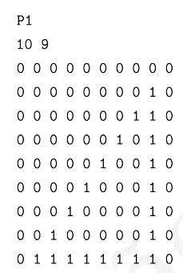
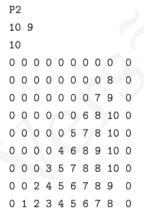
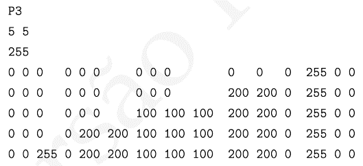
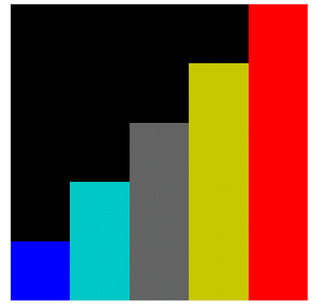

# Scheme-case-study

## Estudo de caso da linguagem de programação Scheme desenvolvido para a matéria de Linguagens de Programação.
>Colaboradores: Eduarda Elger, Ellen Bonafin, Gustavo Pauli, Heloisa Alves e Pablo Hugen.

# 📌Histórico

Os primórdios da linguagem Scheme ocorreram entre 1975 e 1980, quando foi descrita pela primeira vez no Laboratório de Inteligência Artificial e Ciência da Computação do MIT. Foi criado por Guy Steele e Gerald Sussman a partir da lingugem Lisp com intuito de desenvolver uma lingugem de semantica simples e clara e afim de estudar a teoria dos atores de Carl Hewitt.Sussman e Steele tiveram algumas dificuldades em entender alguns detalhes do modelo de Hewitt e suas consequências, então decidiram experimentá-lo construindo uma implementação de brinquedo da linguagem.

Eles escreveram um pequeno interpretador Lisp e adicionaram os mecanismos necessários para criar atores e enviar mensagens, resultando na linguagem Scheme, originalmente chamada Schemer.

Scheme é uma versão estática e recursiva da linguagem de programação. Ela foi desenvolvida com intuito de apresentar uma semântica simples e clara, apresentando poucas formas Diferentes de formar expressões. Uma grande variedade de paradigmas de programação são encontrados em Scheme, entre eles, programação funcional, e programação por passagem de mensagens.

Scheme foi uma das primeiras linguagens de programação a introduzir o lambda cálculo nos métodos da classe principal. Também possibilita a usabilidade de regras de escopo estático e estruturas em bloco em uma linguagem tipada.

# 📌Objetivos, Contextualização e Características

Scheme é uma linguagem de programação multiparadigma que suporta programação funcional e procedural.

# Ambiente de programação

Muitas linguagens oferecem um dispositivo chamado “REPL” (Read-Eval-Print Loop). O REPL é um programa que lê expressões ou trechos de programa, “avalia” (ou “executa”) e mostra o resultado. Python, Ruby, Common Lisp, Haskell e a vasta maioria das implementações de Scheme oferecem um REPL. Na prática, a experiência de usar o REPL é semelhante à de interagir com um computador usando linha de comando em um
terminal

## Algumas Características

Sua Flexibilidade é garantida devido a ausência de restrições tornando dessa forma seu porder ilimitado.

Utilização de sistemas de recursão.

Fortemente tipada.

Lingugem multiparadigma utilizando o paradigma funcional e procedual.

Possui boa capacidade de leitura devido a sua simplicidade, por possuir um pequeno conjunto de regras há a capaciadde de compolas assim tornando uma linguagem confiável e poderosa.

## Paradigma

Como o Scheme é uma linguagem de programação multiparadigma o paradigma funcional é de ação que trata como uma avaliação de funções matemáticas, ele evita estados mutáveis e enfatiza funções, em contraste da programação imperativa, que reforça mudanças no estado do programa.

O paradigma procedural é utilizado muitas vezes como sinônimo de programação imperativa, que especifica os passos que deve seguir para atingir um estado , mas o termo procedural indica que se baseia no numero de chamadas de procedimentos, também conhecidos como rotinas, sub-rotinas ou funções (diferentes das funções matemáticas). Atenta-se que tais procedimentos são similares à avaliação realizada na programação funcional, sendo um conjunto de passos computacionais a serem executados, podendo ser chamado a qualquer hora durante a execução do programa, através de outros procedimentos e até por si mesmo.

-> Existem dois padrões que definem a lingugem: O padrão IEEE P1178 e um padrão popular chamado RnRs.

# 📌Tour pela lingugem

## Instalação e execução

- apt install guile-3.o
- guile

## Tipos de dados básicos

### Boolean

* #t=True - Qualquer coisa diferente de zero e lista vazia

* #f=False - Zero ou lista vazia

### Numbers

* Numero = ex: 22

* Complex = ex: (2+3i)

* Real = ex: (2,8954)

* Racional = ex: (2,8954) (22/2)

* Inteiro = ex: 23

* Numero=Complex=Real=Racional=Inteiro

### Caracteres

São representados pelo prefixo #\

* #\c = caracatere

* #\New Line e #\space = espaço em branco

### Symbols

Tratados como identificadores de variaveis, para especificarmos um symbolo usamos a palavra reservada QUOTE ou aspas simples antes do símbolo.

* quote(xyz) ou `E

### Strings

Não é um tipo simples, ou seja, primitivo como os anteriores, é composta pela combinação de caracteres sendo assim uma sequencia de caracteres de modo estruturado e ente aspas dulpas "".

* (string #\o #\l #\a) ou "Ola"

### Vetores
  São sequencias como as strings mas seus elementos podem ser uma sequencia de qualquer tipo e não apenas de caracteres.

* (vector 01234)

### Dotted pair
  É composto de dois valores arbritarios, sendo o primeiro chamado de car e o segundo de cdr e sua combinaçaão é realizada com a palavra reservada cons.

* (cons 1 #t)

### Listas

Podem ser construídas simplismente colocando os valores desejados entre parenteses e utilizando aspas simples antes do primeiro parêntese ou utilizando a palavra reservada list.

Além disso, listas podem conter qualquer valor, inclusive lista de lista.

Ex: 
`` >`(246810) ou >(list 249810) ``

Assim como os vetores, podemos utilizar car e cdr para acessarmos o primeiro elemento e o restante da lista.

Ex: 
`>(car(list 249810))`

## Expressões condicionais

Para tomar decisões e escolher uma dentre duas ou mais formas a avaliar, Scheme oferece algumas formas especiais.
  
### IF

```
(if(<ab)(squarea squareb)) ou

(if(<x1x2)(>x2x3)
    (if(>x1 x2)(<x2x3)
```
### COND

```
 (Cond (condicao1 consequencia1)
       (condicao2 consequancia2)


       (else alternativa))
```

### CASE
* (case arg expr1 expr2 expr3...)

## Palavras reservadas

### Define e Set

Utilizamos a palavra reservada define para declarar variaveis globais e a SET para alterar variáveis.

```
(define a 23)
    (set! a 6)
```

### Let
Da mesma forma que os argumentos de um procedimento podem ser usados apenas dentro do corpo do procedimento, é possível criar variáveis temporárias acessíveis apenas dentro de um trecho de programa Scheme usando a forma especial let.

```
( let (( nome1 valor1)
            ( nome2 valor2)
            ...)
```

## Palavras-chave

Programas Scheme são feitos de palavras-chave, variáveis, formas estruturadas, dados constantes (números, caracteres, strings, vetores citados, listas citadas, símbolos citados, etc), espaços em branco e comentários.

Palavras-chave, variáveis e símbolos são coletivamente chamados de identificadores. Identificadores pode ser formado a partir da seguinte conjunto de caracteres:

* As letras minúsculas de a até z,
* As letras maiúsculas A a Z,
* Os dígitos de 0 a 9, e
* Os caracteres ? ! . + - \* / ⇔: $% ^ & \_ ~ @.

A lista abaixo contém todas as palavras-chave sintáticas que são definidas quando Scheme é inicializado:


## Operadores
Para processar dados numéricos, Scheme disponibiliza vários Procedimentos Primitivos, como por exemplo, os operadores aritméticos:

* (+)  adição
* (-)  subtracção
* (*)  multiplicação
* (/)  divisão

Então, 5 + 3 se escreve em Scheme como:

`` (+ 5 3) ``

`` + ``

E (5+3) x 2 se escreve da seguinte forma:

`` (* (+ 5 3) 2) ``

### Operadores lógicos

Existem 3 tipos de expressões lógicas, sendo elas, AND, OR e NOT.

`` (and(< 2 5)()< 2 4) =>#t ``

### Operador de comparação:

A comparação x<y pode ser escrita em Scheme como (< x y). Nessa expressão, < é uma função que retorna #t ou #f, dependendo se x é ou não menor que y. Como o teclado normal de um computador não possui o símbolo , este é escrito como <=. Assim, x y vira (<= x y). Da mesma forma, o predicado  é escrito como >=. Muitas linguagens de programação usam essa mesma sintaxe para esses operadores.

## Curiosidades

A linguagem Scheme tem suporte para:

- Programação Genética método pelo qual é inspirado na Teoria da Evolução natural de Darwin (cada programa é visto como um indivíduo em uma população).
- Programação concorrente: Criação de Threads, mutex, memória compartilhada: travas de exclusão mútua, barreiras, semáforos (produtor-consumidor, jantar dos filósofos).
- Criação de gráficos nos formatos Netpbm e SVG.

### Netpbm

É uma família de formatos para imagens gráficas. Todos os formatos netpbm representam a imagem como um mapa de pixels. Há formatos para imagens em preto-e-branco (onde a informação armazenada por pixel é zero ou um); para tons de cinza (onde a informação armazenada por pixel é um número correspondente a algum tom de cinza) e para imagens coloridas (onde são armazenados três números por pixel, indicando a quantidade relativa de vermelho, verde e azul). Os formatos Netpbm permitem armazenar a imagem em formato legível por pessoas, onde cada dado relativo a um pixel é escrito usando sua representação numérica em ASCII, ou em formato binário ilegível e mais compacto.

A tabela a seguir lista os seis formatos Netpbm e suas características:


Todos os formatos iniciam com uma linha onde há apenas o nome do formato, em ASCII (P1, P2, etc).

#### Formato P1: preto e branco, legível

Para o formato P1, a segunda linha contém o número de colunas e o número de linhas da imagem, e os próximos números (separados por espaços) são zero ou um, representando os bits da imagem. O exemplo a seguir é uma imagem de um triângulo:



O arquvio acima representa a seguinte figura, em escala maior:


#### Formato P2: tonsde cinza, legível

Formato semelhante ao P1, exceto que:
* Há mais uma linha entre as dimensões da imagem e os pixels, onde existe um único número. Este é o maior número usado para representar tons de cinza na imagem;
* Ao invés de uns e zeros representando preto e branco, cada entrada é um número representando um tom de cinza: zero representa preto e o maior número representa branco.

O exemplo a seguir é semelhante ao usado na seção anterior, mas desta vez usando tons de cinza.



O arquvio acima representa a seguinte figura, em escala maior:


#### FOrmato P3: em cores, legível

Formato semelhante ao P2, com as seguintes diferenças:
* O número antes dos pixels representa o maior número usado para representar a quantidade de cada cor;
* Cada entrada na matriz de pixels é composta por três números em sequência, representando as quantidades de vermelho, verde e azul.



O arquvio acima representa a seguinte figura, em escala maior:




## Features da linguagem Scheme

• r7rs: a implementação declara implementar corretamente o padrão R7RS.

• exact-closed: todas as operações algébricas com exatos (exceto /) resultam em
números exatos.

• ratios: A operação / com argumentos exatos produz um resultado exato quando o
divisor não é zero (ou seja, a implementação suporta frações exatas).

• exact-complex: a implementação suporta números complexos exatos.

• ieee-float: números inexatos são representados como no padrão IEEE 754.

• full-unicode: todos os codepoints Unicode são suportados como caracteres.

• windows: a implementação de Scheme está rodando em um sistema Windows.

• posix: a implementação de Scheme está rodando em um sistema POSIX.

• unix, darwin, linux, bsd, freebsd, solaris, ... : descreve o tipo de sistema
operacional.

• i386, x86-64, ppc, sparc, jvm, clr, llvm, ... : descvreve a arquitetura da CPU.

• ilp32, lp64, ilp64, ... : descreve o modelo de memória C.

• big-endian, little-endian: descreve a ordem de bytes ao representar palavras.

• nome: o nome da implementação Scheme.

• nome-versao: nome e versão da implementação Scheme.

## Referências

``` http://aleph0.info/cursos/pp/notas/scheme.pdf ```

``` https://www.gnu.org/software/guile/manual/guile.pdf ```


